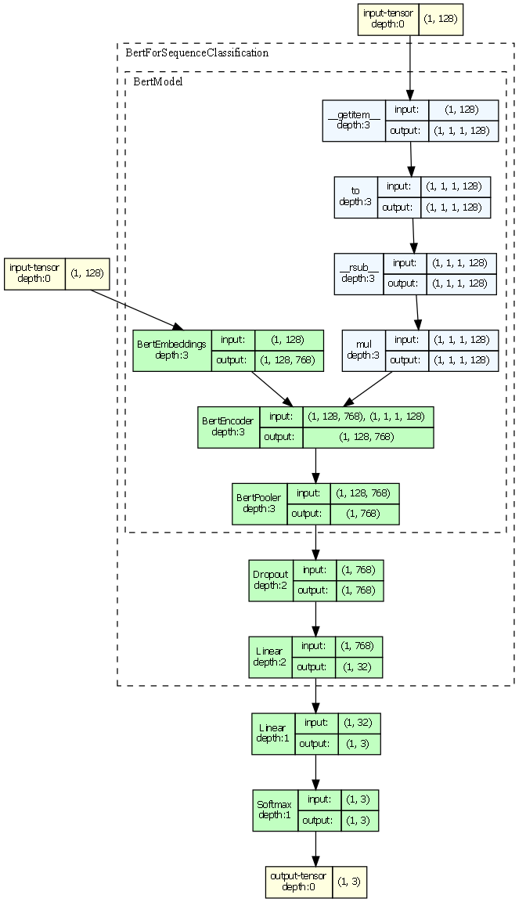
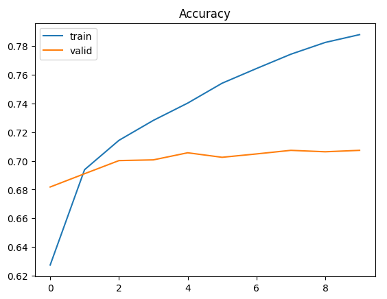
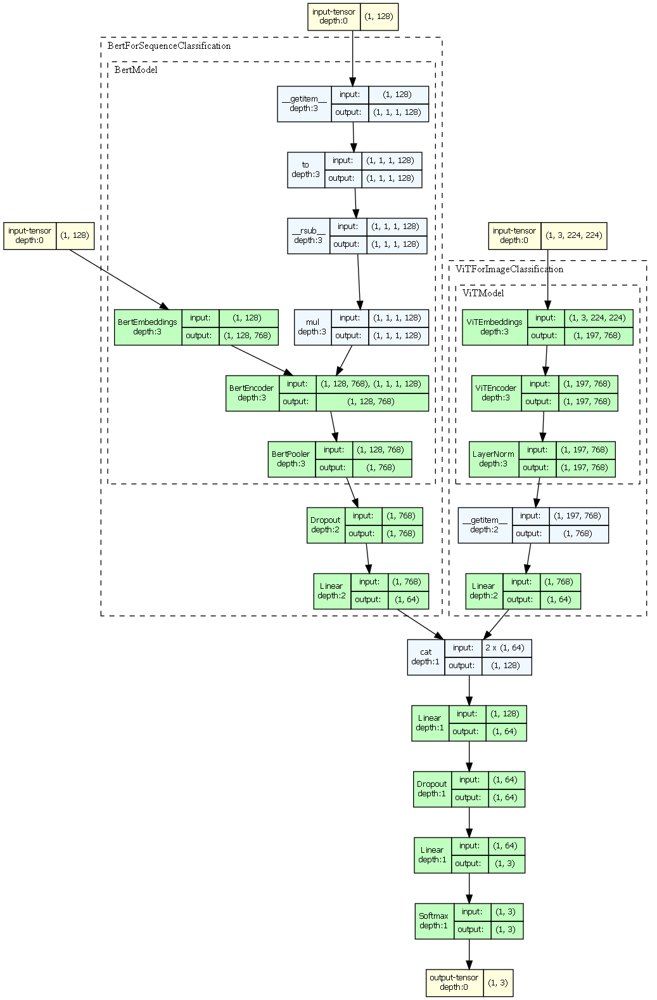
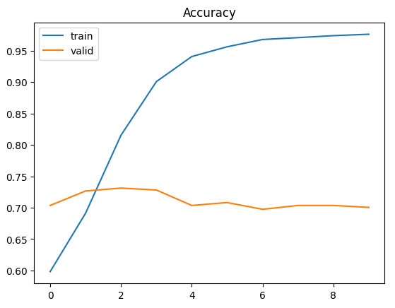
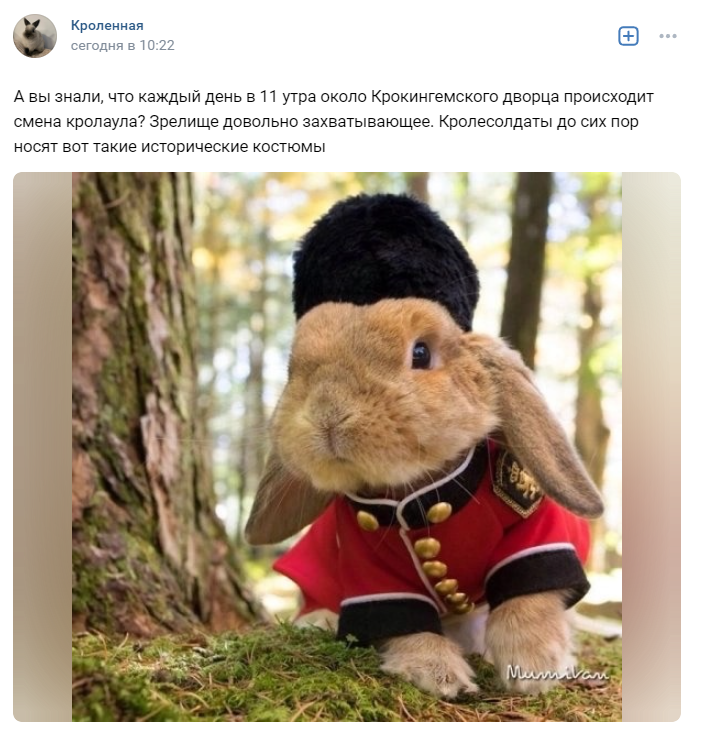

# RuSentimentFactors
System for social media sentiment analysis and sentiment features extracting.


## Technologies:

* __Python 3.9__
* __PyTorch__
* __Docker__
* __Jupyter Notebook__


## Important directories:

* [Notebooks with ml models researches](./notebooks/README.md)
* [Web-server](./ru-sentiment-app/README.md)


## Algorithm description:

1. Download post from social media (the Russian social media [VK](https://vk.com) was chosen).
2. Images and text are extracted from social media post if its exist.
3. The machine learning model classify images and text according to one of sentiment class: positive, negative or neutral.
4. Extract features - keywords from classified post, using *Yake*.


## Machine learning model architecture

There are two main module for text and visual data from post classification:

* Text sentiment model.
* Visual sentiment model.


### Text sentiment model.

The model uses fine-tuned `BERT` transformer for Russian language `DeepPavlov/rubert-base-cased`.

#### Architecture:



#### Training results:



[More info](./notebooks/ru-text-sentiment/deep_learning/transformers.ipynb)


### Visual sentiment model.

The visual sentiment model is multimodal:

* `ViT` (`google/vit-base-patch16-224`) is for image processing.
* `BERT` (`DeepPavlov/rubert-base-cased`) is for image caption processing.

#### Architecture:



#### Training results:



[More info](./notebooks/visual-sentiment/deep_learning/multimodal_model.ipynb)


### Forming results

The text sentiment model gets text sentiment prediction - $p_{text}$.
The image sentiment model gets image sentiment prediction - $p_{image}$.

Post can have one text field and several images. Than the model output is:
* text sentiment prediction: $p_{text}$.
* list of image sentiment predictions: $p_{image_i}, i=1..n, \text{n - image count}$.

Than the post sentiment will be:

$$
p_{post}=
\begin{cases}
p_{text} & \quad \text{if post hasn't images} \\
\dfrac{1}{n} * (p_{image_1} + ... + p_{image_n}) & \quad \text{if post hasn't text} \\
\dfrac{ n * p_{text} + (p_{image_1} + ... + p_{image_n}) }{2n} & \quad \text{if post has text and images}
\end{cases}
$$


## Examples:

* [Positive post](https://vk.com/bunniverse?w=wall-125219968_11753)



Model result:

```json
{
  "id": "0cc3b272-d71d-4ae9-9415-d1fce52c96e8",
  "post_id": "-125219968_11753",
  "predicted_value": "positive",
  "text_prediction_details": {
    "positive": 0.99,
    "neutral": 0.001,
    "negative": 0.0089
  },
  "image_info": [
    {
      "id": "6f5f5548-fae9-441b-adc5-35ec1cc770fc",
      "prediction_details": {
        "positive": 0.9748,
        "neutral": 0.0246,
        "negative": 0.0007
      }
    }
  ]
}
```

* [Neutral post](https://vk.com/countryballs_re?w=wall-67580761_9217444)


Model result:

```json
{
  "id": "e69870fc-8ef3-4a1a-af83-f013669dd91e",
  "post_id": "-67580761_9217444",
  "predicted_value": "neutral",
  "text_prediction_details": {
    "positive": 0.1666,
    "neutral": 0.002,
    "negative": 0.8314
  },
  "image_info": [
    {
      "id": "9d4bfe2d-f8ba-4410-880b-b4a35fb5bb65",
      "prediction_details": {
        "positive": 0.987,
        "neutral": 0.012,
        "negative": 0.001
      }
    },
    {
      "id": "bebe504a-5759-498b-9984-523f15416c1e",
      "prediction_details": {
        "positive": 0.8322,
        "neutral": 0.1343,
        "negative": 0.0335
      }
    },
    {
      "id": "1a10dbe9-2f41-43a6-b1e2-ba62e92f06d0",
      "prediction_details": {
        "positive": 0.9734,
        "neutral": 0.0263,
        "negative": 0.0003
      }
    }
  ]
}
```

* [Negative post](https://vk.com/countryballs_re?w=wall-67580761_9219840)


Model result:

```json
{
  "id": "41e5ec3b-4816-4e53-bfd9-644b005121f6",
  "post_id": "-67580761_9219840",
  "predicted_value": "negative",
  "text_prediction_details": {
    "positive": 0.0041,
    "neutral": 0.0305,
    "negative": 0.9653
  },
  "image_info": [
    {
      "id": "b2cc33d4-59b5-4bfc-9670-479c1cd11149",
      "prediction_details": {
        "positive": 0.0085,
        "neutral": 0.3212,
        "negative": 0.6703
      }
    }
  ]
}
```
